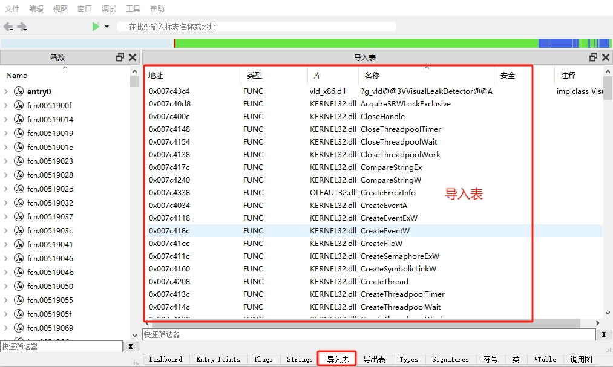
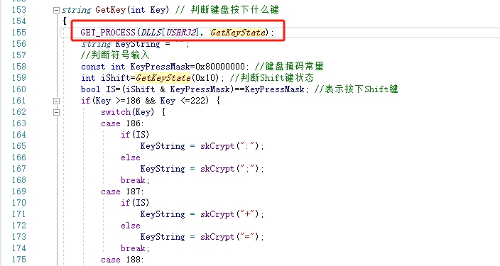

# 隐藏导入表中导入函数的方法

## 1.导入表（Import Table）是什么？
在 Windows 可执行文件（EXE / DLL） 中，导入表（Import Table） 是用于管理从其他动态链接库（DLL）加载和调用函数的
一个结构。

当程序调用 Windows API 或 其他 DLL 提供的函数时，这些函数不会直接存储在 EXE 文件里，而是由 导入表 记录它们的来源
（即哪个 DLL 提供了哪些函数）。<sup>[1]</sup>

杀毒软件 通常会扫描可执行文件（EXE/DLL）的 导入表（Import Table） 以检测恶意行为。这是因为导入表能反映出程序依赖
的 DLL 和 API，很多恶意软件会修改导入表或使用可疑的导入函数。

当我们编写的程序调用了某些敏感函数时，程序容易被杀毒软件认定为恶意软件。隐藏导入表可以一定程度上绕过杀毒软件。

## 2.导入表怎么查看？



使用工具 [cutter](https://cutter.re/)可以方便查看应用程序（包括动态链接库）的导入表。

## 3.如何隐藏导入表？

直接使用 *LoadLibrary + GetProcAddress* 运行时获取 API，而不在导入表中显式列出。

例子：
```c++
typedef void* (WINAPI* LoadLibFunc)(const char*);
LoadLibFunc pLoadLibrary = (LoadLibFunc)GetProcAddress(GetModuleHandle("kernel32.dll"), "LoadLibraryA");
```

在这个例子中，定义了一个函数类型`LoadLibFunc`，将`GetProcAddress`所得的函数指针转换为该类型的变量`pLoadLibrary`，
而后，通过调用函数pLoadLibrary来加载动态链接库。这种间接调用`LoadLibraryA`的方式不会在程序导入表增加`LoadLibraryA`。

这种方法有一个不便之处，即我们针对每一个需要在导入表隐藏的函数，都需要先定义一个函数类型，且该函数类型可能各不相同。

接下来，假设我们想隐藏另一个函数`GetKeyState`，我们又得声明一个函数类型：

```c++
typedef SHORT(WINAPI*GetKeyStateM)(int nVirtKey);
GetKeyStateM func = (GetKeyStateM)GetProcAddress(GetModuleHandle("user32.dll"), "GetKeyState");
```

并且在使用`GetKeyState`的地方用`func`替代。

## 4.有没有更简单一点的方法？

通过宏定义可以使得上述方法更为简单或者便捷，且对既有代码的侵入性比较低，可以根据需求关闭或开启这种隐藏能力。
这个宏需要提供2个参数：模块句柄和函数名称，并且对函数名称用`skCrypt`宏隐藏字符串。

```c++
#define GET_PROCESS(m, p) auto static p=reinterpret_cast<decltype(&::p)>(GetProcAddress(m, skCrypt(#p)))
```


如上所述，我们定义了一个宏 *`GET_PROCESS`*，每当我们想隐藏导入表中的某个函数时，我们就使用这个宏定义。

比如我们想隐藏`GetKeyState`，只需要在调用该函数的代码上方增加一行宏定义即可。编译器自动检测到函数`GetKeyState`
是宏定义所声明的函数指针，而非原先`user32.dll`模块中的函数。`DLLS`是全局变量，是我们预先加载好的一系列dll句柄。

## 5.前提条件

使用上述宏定义有两个个前置条件，一是编程工具支持这种形式，即局部变量可以和既有函数同名，编译时优先取局部变量；
二是编程语言支持auto类型推导（大概率也是看IDE能力）。本人用Visual Studio 2019是可以使用这个宏定义的。

**您对该方法感觉怎么样？您有什么更好的方法呢？请提交issue分享您的观点。**

## 6.参考资料

[1] "导入表是什么", ChatGPT, 2025/02/04
