# 大灰狼远控程序

“大灰狼远程控制程序”通常是指一种被黑客或恶意软件用于远程控制用户计算机的恶意程序。
这类程序允许攻击者通过互联网或其他网络，远程访问和控制被感染的计算机，执行各种操作，
例如窃取个人信息、安装其他恶意软件、监控用户活动等。

这种类型的恶意软件通常会隐藏在受感染的文件或程序中，当用户不小心下载或运行时，
它会在后台悄无声息地运行。一旦安装，黑客可以通过远程连接操控受害者的电脑，进行数据窃取、
传播病毒或攻击其他目标等活动。[1]

## 1. 资料准备

### (1.1) 开源代码

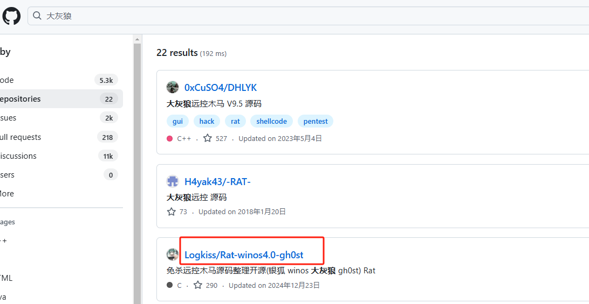

我于2025年1月29日在GitHub检索“[大灰狼](https://github.com/search?q=大灰狼&type=repositories&p=1)”
相关项目，共有22条结果，我clone的是[Logkiss/Rat-winos4.0-gh0st](https://github.com/Logkiss/Rat-winos4.0-gh0st)。

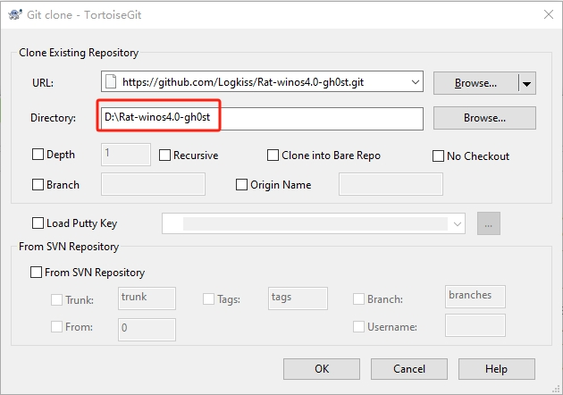

我们需要将上述项目clone到本地目录，比如：*D:\Rat-winos4.0-gh0st*

### (1.2) 编译工具

Visual Studio 2019：我使用的IDE是VS2019。理论上讲，按照本文的方法，用其他版本的IDE操作，也是可以的。

Xtreme Toolkit Pro（v18.5）：一款为开发者提供丰富的用户界面（UI）组件库和工具集的软件开发工具包，
特别适用于C++和MFC（Microsoft Foundation Classes）开发。
它提供了一整套UI控件和工具，旨在简化Windows桌面应用程序的开发过程。[2] 我使用的版本
在[这里](https://blog.csdn.net/SilenceNet/article/details/126132736)可以下载。

## 2. 打开项目

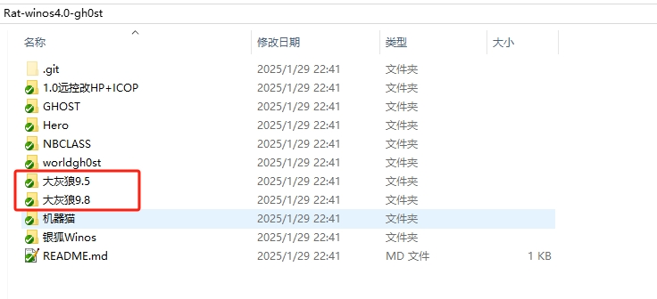

打开所克隆的项目，其中有大灰狼9.5和大灰狼9.8两个目录。很明显，大灰狼9.8目录缺少项目文件，所以我们使用大灰狼9.5。

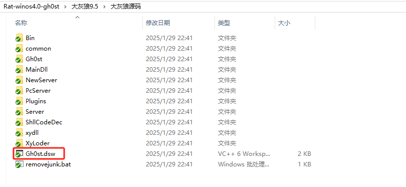

.dsw 文件（Developer Studio Workspace） 是 Microsoft Visual Studio 6.0 及更早版本 使用的 工作区文件，
主要用于管理多个 .dsp（Developer Studio Project）项目。它属于旧版的 Microsoft Visual C++（VC6.0） 
项目文件格式，在较新的 Visual Studio 版本（如 VS 2002 及之后）中已被 .sln（Solution）文件 取代。

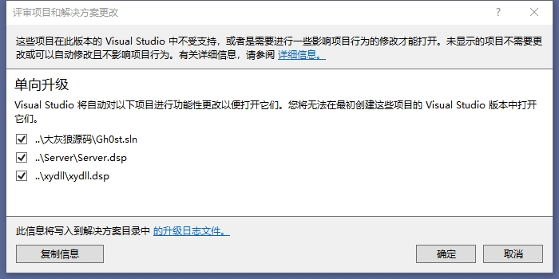

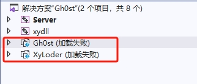

从“Gh0st.dsw”可见，这个项目使用的是非常老的编译器。使用VS2019打开该文件，会提示升级，点击确定即可。
有2个项目会升级失败，包括“Gh0st”。另一个项目“XyLoader”无需关注。我们将Gh0st从解决方案删除。

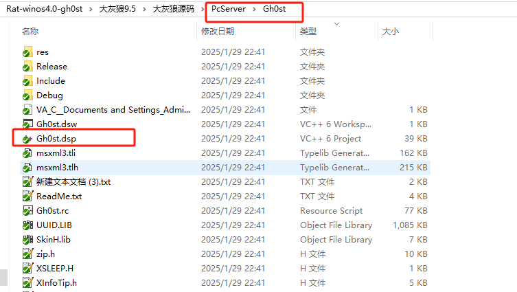

注意到在另一个目录有gh0st项目文件，我们将该项目添加到解决方案。

## 3. 生成项目

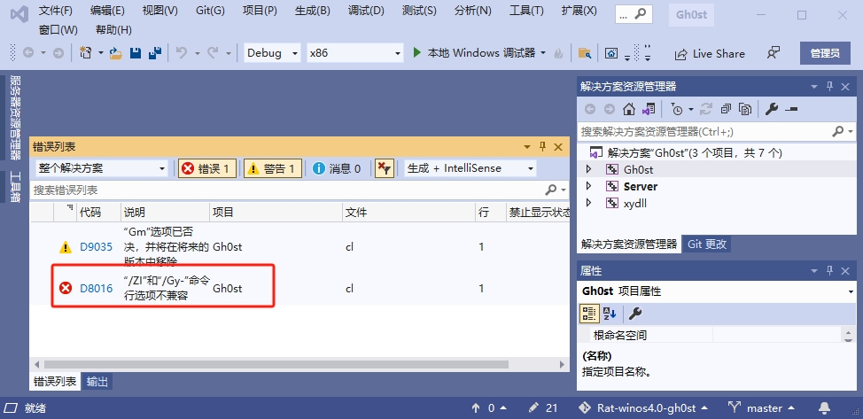

选中Gh0st进行生成，出现了第一个错误“/ZI和/Gy-命令行选项不兼容”，通过ChatGPT得知，/ZI 选项启用了 
Edit and Continue（编辑并继续） 调试模式，使你可以在调试过程中修改代码，并立即生效，无需重新编译整个项目。
这个选项要求启用“函数级别链接”（/Gy），因为它依赖于函数的单独编译单元。为此修改项目属性。
进入 项目属性 → C/C++ → 代码生成→ 找到 “启用函数级链接”，设置为 “是（/Gy）”。

接下来，我将列举编译过程中出现的问题，并提供解决方法。
**提示，为了使项目编译更快，请开启并行编译和使用预编译头。**

使用预编译头时，有些cpp文件并没有包含"stdafx.h"，需要添加这个包含文件。还有一些cpp文件包含的是"..\stdafx.h",
我们将其统一为"stdafx.h"，且在附加包含目录添加相关项 *$(ProjectDir)* 以便所有cpp文件能找到该头文件。

### 3.1 无法打开包括文件: “XTToolkitPro.h”

您需要下载前文所述“**Xtreme Toolkit Pro（v18.5）**”并在本地进行编译。将相关目录添加到项目属性中：

C++头文件附加包含目录： *D:\github\XTToolkitPro\Source*

C++库文件附加包含目录： *D:\github\XTToolkitPro\lib\vc160*

资源文件附加包含目录： *D:\github\XTToolkitPro\Source*

### 3.2 “i”: 未声明的标识符

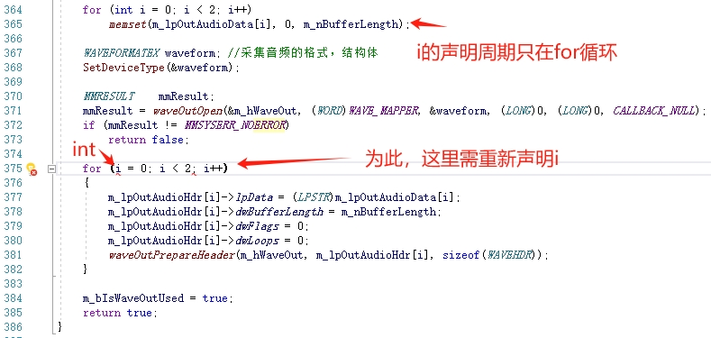

这个错误是由于早期在for循环定义的迭代变量i，其生命周期是可以延续到for循环外部，但是后来的Visual Studio不支持了。
因此，我们将此类变量放到for循环外部进行定义。

### 3.3 缺少类型说明符 - 假定为 int

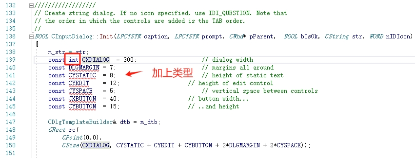

这个错误是由于早期Visual Studio编译器，支持在声明const变量时不带类型，但是后来的Visual Studio不支持了，为此
我们需要加上int类型。

### 3.4 无法打开包括文件: “..\Bin\Plugins\C_FILE.h”

将其修改为“#include "..\..\Bin\Plugins\C_FILE.h"”，其他和“Bin\Plugins”包含目录相关的错误照此修改。

### 3.5 “初始化”: 无法从“const char *”转换为“char *”

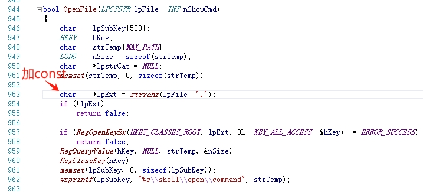

### 3.6 “static_cast”: 函数无法转换为基类类型

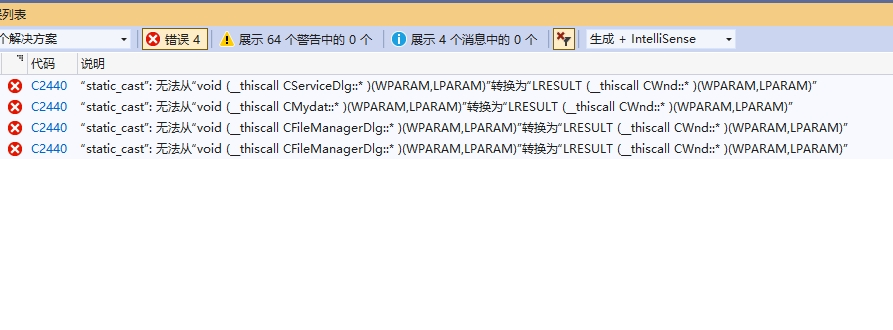

很明显，这是由于MFC类库发生变化了，在新的MFC库，上述函数都需要LRESULT返回值，我们按照要求修改即可。
这几个函数的返回值都填S_OK。

### 3.7 模块对于 SAFESEH 映像是不安全的

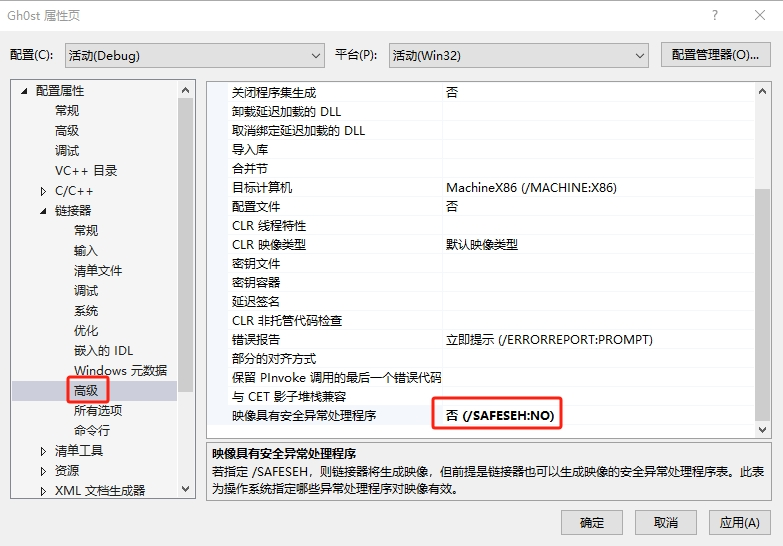

经过上述代码微调，编译报错已经少了很多。编译第三方库libxvidcore.lib和va_g729a.lib报“SAFESEH 映像是不安全的”
错误，将其关闭即可。

### 3.8 error LNK2001: 无法解析的外部符号

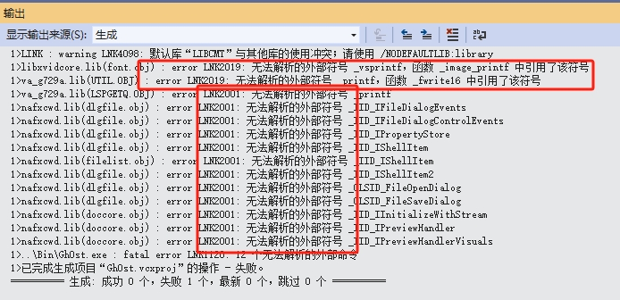

现在只剩下12 个无法解析的外部命令了。经过询问ChatGPT得知是缺少 _uuid.lib_ 这个库，但是即使把这个uuid库加到本项目
或者使用该项目既有的uuid.lib文件都无济于事；但经过我的调查，链接到“Windows Kits”的Uuid.Lib是可以解决该问题的。

### 3.9 无法解析的外部符号 _vsprintf、_printf

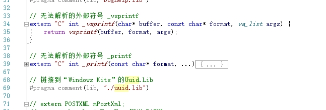

我们自己实现这2个函数，而不依赖于C库，可以解决此问题。让ChatGPT帮我们写这2个函数即可。由于printf只是输出一些日志信息，
并不关键，我们的简单替换实现对程序无影响；而_vsprintf调用vsprintf确保了它也是可靠的。注意包含头文件 **iostream** 和 **cstdarg**。

### 3.10 error LNK1169: 找到一个或多个多重定义的符号

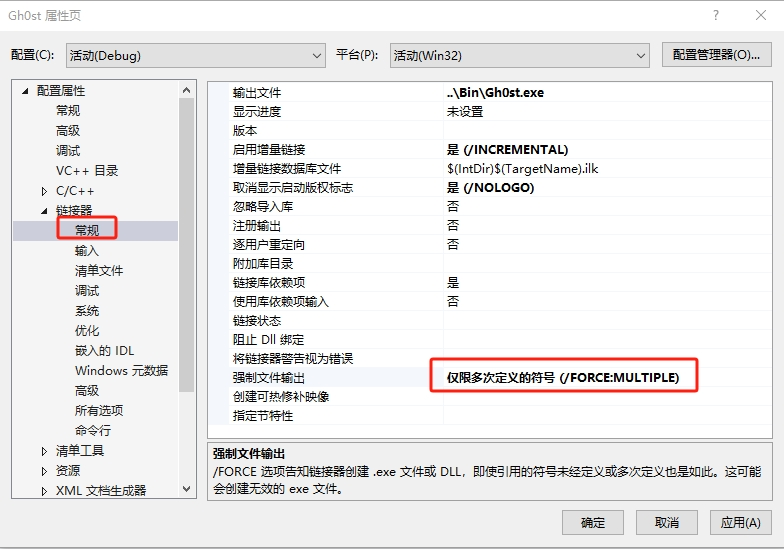

经过上面的修改，我们离成功只差最后一步了。对于“重定义的符号”这类错误，我们可以使编译时强制链接到其中一个符号。
操作方法如图所示。

## 4. 运行程序

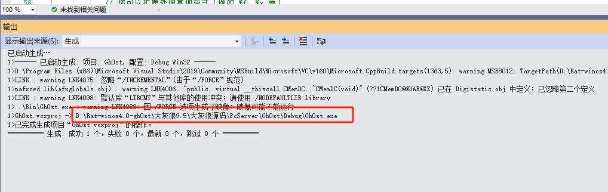

经过第3步的一系列操作，我们成功生成了“Gh0st.exe”。接下来启动调试，看看灰太狼到底长什么样子。

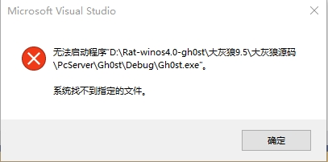

这是小问题，修改项目属性即可，将输出文件作为调试命令进行启动。

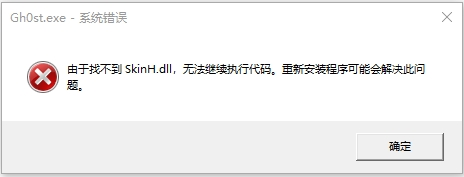

不要慌，这也是小问题，我们把相关dll拷贝到可执行文件目录即可。

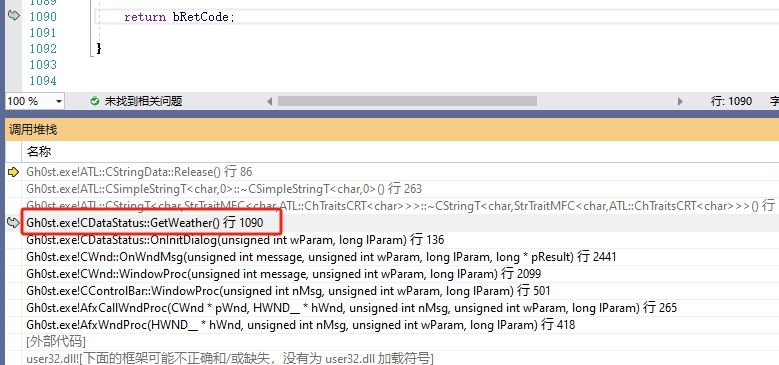

程序启动了，但是崩溃了，根据调用堆栈显示是在"GetWeather"函数，我们将调用此函数的代码行注释掉。
展示天气是锦上添花的功能，没有获取到天气不会影响程序主功能。

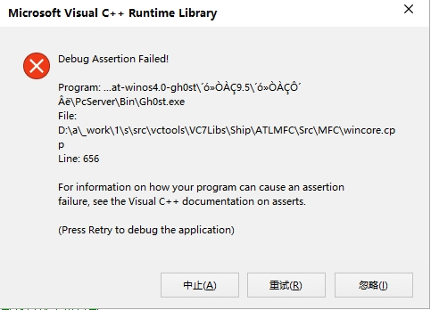
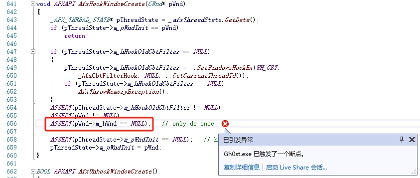
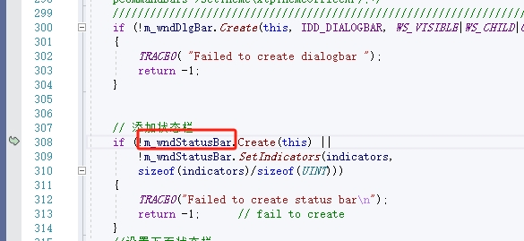

很明显触发了“ASSERT(pWnd->m_hWnd == NULL)”断言，应该是`m_wndStatusBar`被多次初始化，这个对象只能Create一次。

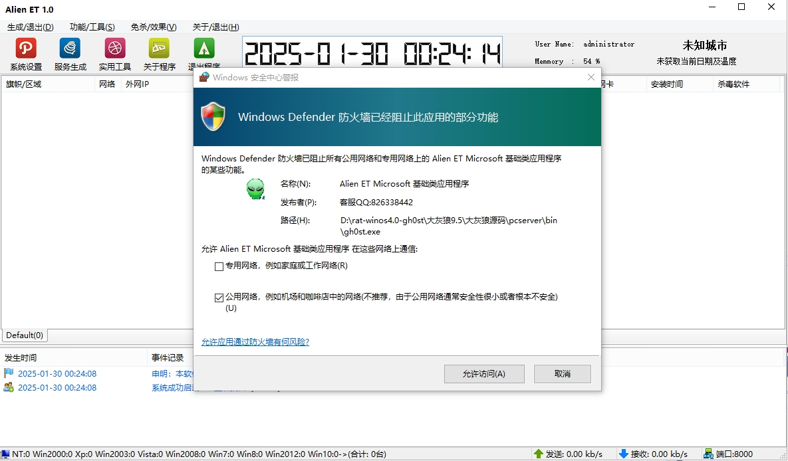

经过我们的不懈努力，大灰狼终于来了！

## 5. 生成服务

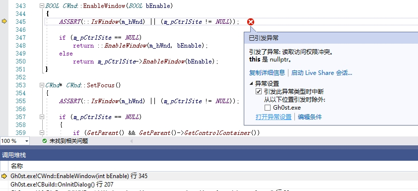

点击生成服务，程序崩溃了，看来想要能稳定运行此程序，还有很长的路要走。后续，我会将已经改好的支持 Visual Studio 编译的
代码上传到我的GitHub；在我的亲自指挥下，编译大灰狼远控程序源码已经不成问题，后面我会亲自部署大灰狼远程程序，一窥其究竟。
敬请关注和支持！

## 6. 参考资料

- [1] "介绍一下大灰狼远程控制程序", ChatGPT, 2025/01/29.
- [2] "概要介绍一下Xtreme Toolkit Pro", ChatGPT, 2025/01/29.
