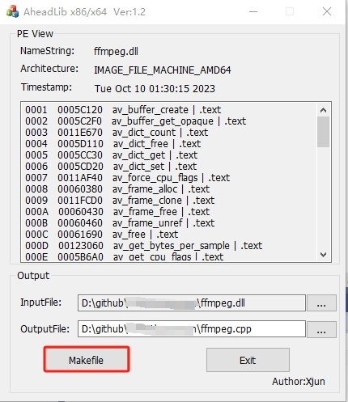
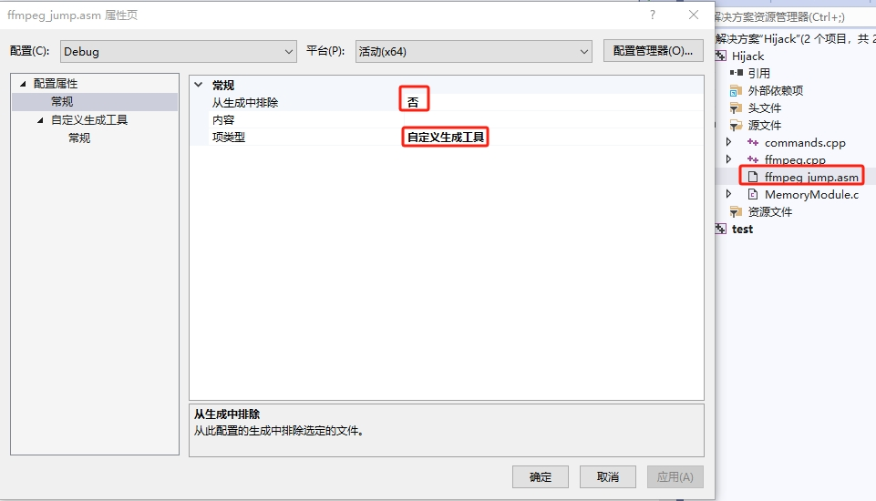
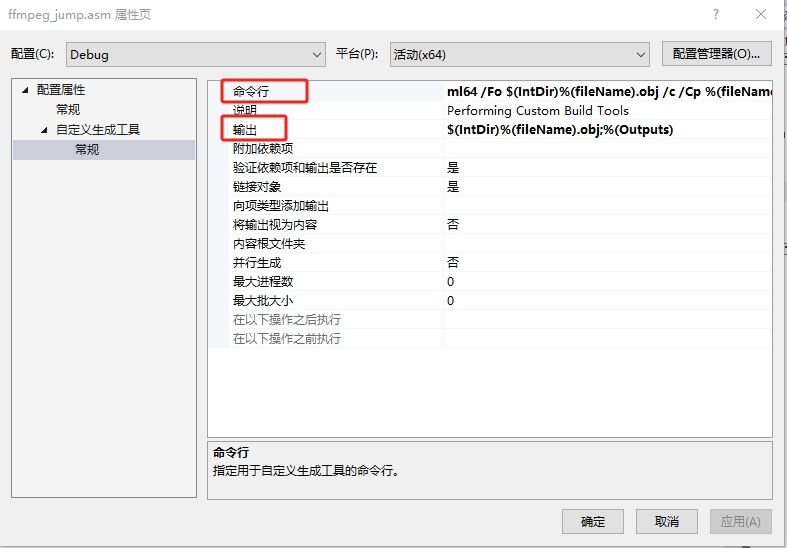

## 白加黑<sup>[1]</sup>

在 红蓝对抗（Red Team vs. Blue Team） 网络安全演练中，“白加黑” 主要指 白+黑结合的攻击手法，
即 合法手段（白）+ 非法手段（黑） 混合使用，来规避安全防御并实现攻击目标。

“白加黑” 在红蓝对抗中指的是 利用合法工具（白）掩盖非法攻击（黑），让攻击行为更难被检测。

白（White） → 合法、正常的系统功能、工具（如 Windows 计划任务、PowerShell、RDP）。

黑（Black） → 恶意利用、攻击行为（如木马、权限提升、数据窃取）。

这种方式使攻击看起来像是正常的系统操作，降低被检测的风险。

核心思路：用“白”来隐藏“黑”！ 

## 本文研究目的

本文参考文章：[DLL劫持-白加黑](https://www.cnblogs.com/xiaoxin07/p/18097421)<sup>[2]</sup>，实现对`ffmpeg.dll`进行补丁操作。

由于`ffmpeg.dll`是视频编解码DLL，使用非常广泛，因此有一定的代表作用。

## 工具

- IDE：Visual Studio 2019
- AheadLib-x86-x64: https://github.com/strivexjun/AheadLib-x86-x64
- MemoryModule：https://github.com/fancycode/MemoryModule

## 代码生成



借助于*AheadLib-x86-x64*，可基于待研究的DLL生成初步的代码。原理是扫描DLL中的函数，生成汇编语言和DLL导出清单。

点击“Makefile”，我们将得到2个文件：

- ffmpeg.cpp：这个是我们制作补丁DLL的初步代码，在Visual Studio 2019中新建DLL工程，把该文件包含进去。
- ffmpeg_jump.asm：这个是汇编代码，需要在Visual Studio 2019进行设置。




 
针对汇编代码`ffmpeg_jump.asm`，我们需要将该文件添加到VS2019中，并在属性进行设置：

- 命令行： ml64 /Fo $(IntDir)%(fileName).obj /c /Cp %(fileName).asm
- 输出：$(IntDir)%(fileName).obj

## 补丁制作

### 1. DllMain修改

```c++
BOOL APIENTRY DllMain(HMODULE hModule, DWORD dwReason, PVOID pvReserved)
{
	if (dwReason == DLL_PROCESS_ATTACH)
	{
		DisableThreadLibraryCalls(hModule);

		if (Load() && Init())
		{
			TCHAR szAppName[MAX_PATH] = TEXT("MyApp.exe");//请修改宿主进程名
			TCHAR szCurName[MAX_PATH];

			GetModuleFileName(NULL, szCurName, MAX_PATH);
			PathStripPath(szCurName);

			//是否判断宿主进程名
			if (StrCmpI(szCurName, szAppName) == 0)
			{
				//启动补丁线程或者其他操作
				HANDLE hThread = CreateThread(NULL, NULL, ThreadProc, NULL, NULL, NULL);
				if (hThread)
				{
					CloseHandle(hThread);
				}
			}
		}
	}
	else if (dwReason == DLL_PROCESS_DETACH)
	{
		Free();
	}

	return TRUE;
}
```

在`DllMain`函数中，会对进程名称进行比对，需要将进程名称修改为我们要打补丁的进程，或者去掉这个名称判断逻辑。

### 2.加载原始DLL

```c++
BOOL WINAPI Load()
{
	TCHAR tzPath[MAX_PATH];
	TCHAR tzTemp[MAX_PATH * 2];

	//
	// 这里是否从系统目录或当前目录加载原始DLL
	//
	//GetModuleFileName(NULL,tzPath,MAX_PATH); //获取本目录下的
	//PathRemoveFileSpec(tzPath);

	GetSystemDirectory(tzPath, MAX_PATH); //默认获取系统目录的

	lstrcat(tzPath, TEXT("\\ffmpeg.dll"));

	g_OldModule = LoadLibrary(tzPath);
	if (g_OldModule == NULL)
	{
		wsprintf(tzTemp, TEXT("无法找到模块 %s,程序无法正常运行"), tzPath);
		MessageBox(NULL, tzTemp, TEXT("AheadLib"), MB_ICONSTOP);
	}

	return (g_OldModule != NULL);
}
```

在`Load`函数中加载原始DLL，以便进程调用这些函数时不会出现问题，而是由我们制作的新DLL去调用原始函数。

**提示**：可以将原始DLL转换为C数组，从内存中加载原始DLL，这样子只需要将我们制作的新DLL替换原始DLL即可，
否则就需要将原始DLL改名，由我们的新DLL去`Load`这个改名DLL。

如果装了Git，我们会有一个名称"xxd.exe"的程序位于`C:\Program Files\Git\usr\bin\xxd.exe`，执行命令：
```bat
xxd -i ffmpeg.dll > ffmpeg_dll.cpp
```

其中，`ffmpeg_dll.cpp`就是内存中的原始DLL，借助于*MemoryModule*即可在内存中执行原始DLL。

### 3.执行补丁
```cpp
DWORD WINAPI ThreadProc(LPVOID lpThreadParameter)
{
	HANDLE hProcess;

	PVOID addr1 = reinterpret_cast<PVOID>(0x00401000);
	BYTE data1[] = { 0x90, 0x90, 0x90, 0x90 };

	//
	// 绕过VMP3.x 的内存保护
	//
	hProcess = OpenProcess(PROCESS_VM_OPERATION | PROCESS_VM_READ | PROCESS_VM_WRITE, FALSE, GetCurrentProcessId());
	if (hProcess)
	{
		WriteProcessMemory(hProcess, addr1, data1, sizeof(data1), NULL);

		CloseHandle(hProcess);
	}

	return 0;
}
```

在线程`ThreadProc`里面执行我们的补丁操作，这样，一个带补丁的`ffmpeg.dll`就做好了，将其覆盖原始DLL，启动所属程序，就触发了我们的补丁操作。

## 延伸讨论

对其他DLL的补丁操作也是同理。为了扫描进程加载了哪些DLL，可以利用下述工具：

- 查看依赖DLL：https://github.com/lucasg/Dependencies

- 进程监视器：https://learn.microsoft.com/de-de/sysinternals/downloads/procmon

## 参考资料

[1] ChatGPT, 红蓝对抗中的“白加黑”是啥？2025/02/20

[2] https://www.cnblogs.com/xiaoxin07/p/18097421
