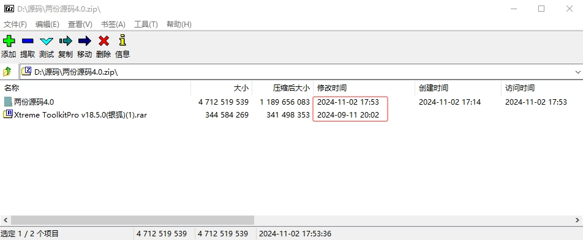
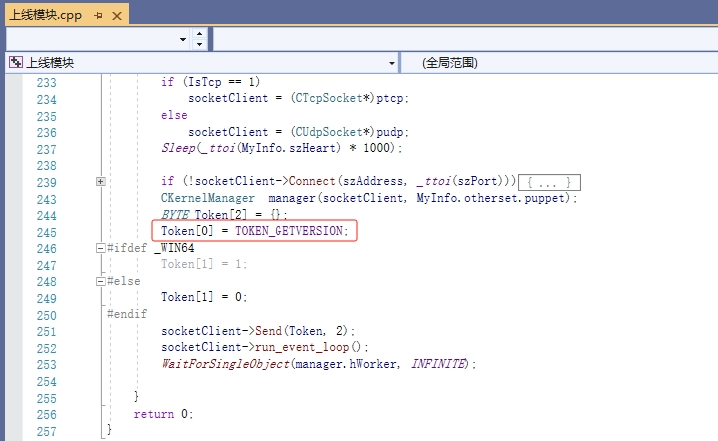
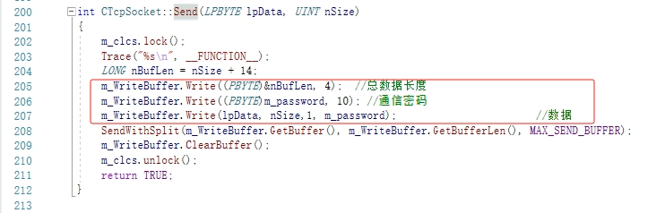
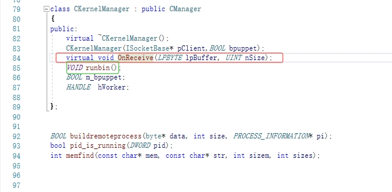
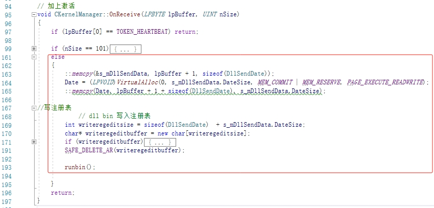
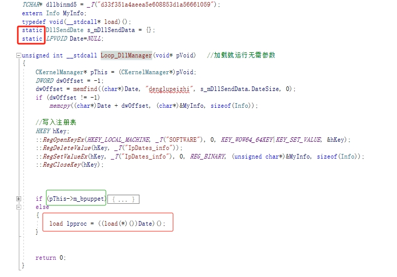
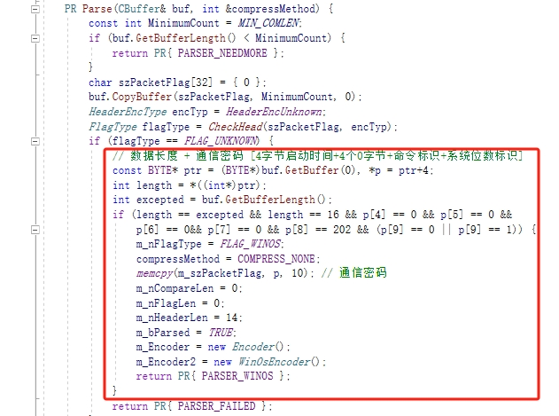
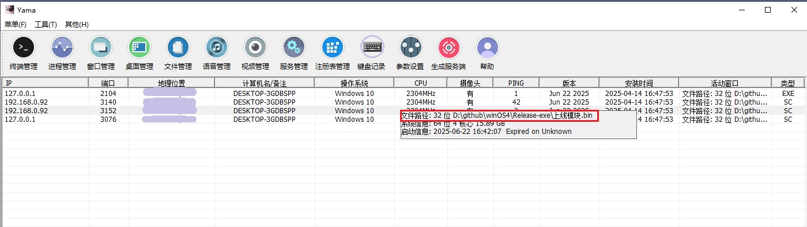

# 研究背景和目的

“银狐”远控程序是一款远程控制工具，通常被归类为远程访问木马（Remote Access Trojan，简称RAT）。
这种工具最初可能伪装成合法软件或利用各种漏洞和社工手段悄无声息地渗透到目标计算机中，一旦成功安装，
攻击者便可以对受控系统进行全面操控。

本文对银狐木马的控制端程序进行分析，并且令我们的控制端程序（非银狐主控）得以控制银狐客户端程序。
实验结果表明，对于一些采用相同上线方式的木马，不采用原版主控，可以做到偷天换柱。

---

# 1.资料准备


- 泄露的银狐木马源码，日期为2024年11月2日
- 本文将实现用[SimpleRemoter](https://github.com/yuanyuanxiang/SimpleRemoter)来控制银狐木马

# 2.银狐木马上线流程



1.发送上线指令: 如图所示，上线模块将发起上线请求，指令号是“TOKEN_GETVERSION（4）”，长度是2，紧随其后是系统位数标识。



2.数据协议：上述上线请求会按照图示协议进行封装，数据总长度+通讯密码+数据。数据总长度用4个字节，通讯密码用10个字节，
数据会基于通讯密码进行简单加密。密码格式如下：

*系统启动以来经过的毫秒时间（4字节） + 零字节（4字节） + TOKEN_ACTIVED - 202（1字节） + 系统位数标识（1字节）*



3.接收控制端响应：客户端在`CKernelManager`的`OnReceive`虚函数接收客户端的响应消息，并最终会调用`runbin`函数启动线程。



具体地，在`OnReceive`函数会处理3种情况：

- TOKEN_HEARTBEAT（201）指令，这是来自主控的心跳，无需处理。但实际上客户端会判断，如果很久没有收到心跳，会重新发起上线请求；
- 长度101字节的指令：这个没有用指令号而是用长度判断，明显是草台班子里面的人不清楚流程，图省事做的判断。实质上是接收到一个md5；
- 其他指令：报文是DllSendDate，而且草台班子存在大量将Data拼错成Date的现象，初步认为代码作者英文水平不高，除非恶意为之。
该分支处理Shellcode，会将数据写入注册表，方便后续从注册表读取数据进行上线，而无需再次请求。

接下来会经过线程，代码最终跳转到`Loop_DllManager`函数处理。更为严重的时，代码使用大量全局变量，猜测是为了省事。
这种行为存在诸多潜在问题，比如内存冲突和泄露。



4.启动Shellcode：在`Loop_DllManager`线程中，程序根据"denglupeizhi"标识，向内存写入相关信息，比如主机分组信息，并且配置信息也会写入注册表。
根据`m_bpuppet`标识，会在远程进程注入Shellcode作为“傀儡”；或者在本程序执行Shellcode。

```c++
load lpproc = ((load(*)())Date)();
```

至此，我们把银狐木马上线流程分析透彻了。它本质上是通过SOCKET请求Shellcode到内存中执行，假如上线地址是SimpleRemoter，而将Shellcode发送给银狐木马，
则上线的客户端实质就是SimpleRemoter的控制端程序，一次完美的偷天换柱。

# 3.偷天换柱



1.识别银狐：根据前面分析，我们需要对银狐的客户端进行识别。这是为了保证主控既能响应正常的请求，又支持响应银狐的上线请求。如图所示，
我们也做一回“草台班子”，根据银狐通讯协议，粗暴认为只要数据满足一些特征，就是银狐木马的上线请求。这有99.99%以上的概率不会出错。

2.响应银狐请求：在`CMy2015RemoteDlg::MessageHandle`函数添加响应逻辑。

```c++
	case TOKEN_GETVERSION: // 获取版本
	{
		// TODO 维持心跳
		bool is64Bit = ContextObject->InDeCompressedBuffer.GetBYTE(1);
		Buffer* bin = m_ServerBin[is64Bit ? PAYLOAD_DLL_X64 : PAYLOAD_DLL_X86];
		DllSendData dll = { TASK_MAIN, L"ServerDll.dll", is64Bit, bin->length()-6 };
		BYTE *resp = new BYTE[1 + sizeof(DllSendData) + dll.DataSize];
		resp[0] = 0;
		memcpy(resp+1, &dll, sizeof(DllSendData));
		memcpy(resp+1+sizeof(DllSendData), bin->c_str() + 6, dll.DataSize);
		m_iocpServer->OnClientPreSending(ContextObject, resp, 1 + sizeof(DllSendData) + dll.DataSize);
		SAFE_DELETE_ARRAY(resp);
		break;
	}
```
因为SimpleRemoter的客户端已经支持Shellcode或内存DLL上线，因此对银狐进行偷天换柱也就较为简单。代码所示，我们将数据封装成银狐木马所需格式即可。

# 4.效果展示



我们用银狐的主控程序，生成银狐客户端程序，上线地址填写`Yama.exe`（SimpleRemoter主控）的监听地址，启动银狐木马，完美实现偷天换柱。
由于银狐木马接收到的是SimpleRemoter的Shellcode，则`Yama.exe`的控制能力都能正常使用。

**扩展思考**：凡是采用SOCKET请求执行代码的此类恶意程序客户端，都可以对其主控进行偷天换柱。

# 5.遗留问题

YAMA没有响应银狐客户端的心跳，每隔一定时间会重新收到上线请求，导致上线客户端数量增加，但都是重复的。

本文的相关代码实现请看：https://github.com/yuanyuanxiang/SimpleRemoter

# 🔒 免责声明

本研究涉及的内容仅限于木马程序、计算机病毒、远程控制工具以及其他可能被归类为恶意软件的技术，其目的仅为技术研究、教育学习与安全防护目的，并不用于任何非法用途。

作者在此郑重声明：

本文所述技术和资料仅供合法用途参考，任何人若使用本文中涉及的内容进行违法活动、恶意攻击、未经授权的入侵或其他不当行为，均与作者无关，由行为人自行承担一切法律与道德后果。

请所有读者严格遵守相关法律法规，提升安全意识，切勿以身试法。
